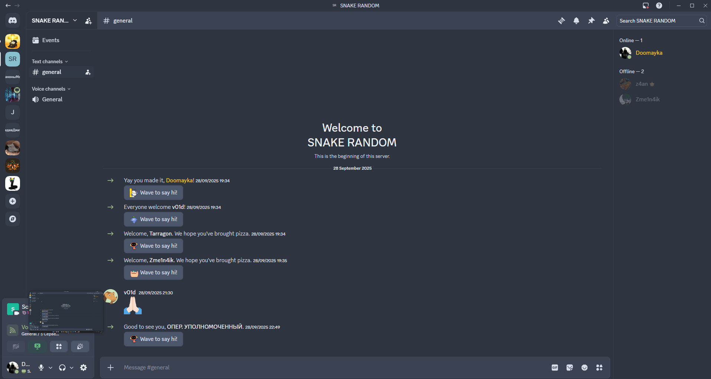

# Nord Dark

*Unofficial Nord theme port for Discord.*



Installation:

1. Open Settings
2. Go to the Themes section
3. Click the "Edit QuickCSS" button
4. Paste:

```css
@import url("https://raw.githubusercontent.com/Doomaykaka/Discord-Nord-Theme/refs/heads/main/dark.css");
```

Or:

1. Open Settings
2. Go to the Themes section
3. Open the "Online Themes" tab
4. Paste the link:

```
https://raw.githubusercontent.com/Doomaykaka/Discord-Nord-Theme/refs/heads/main/dark.css
```
